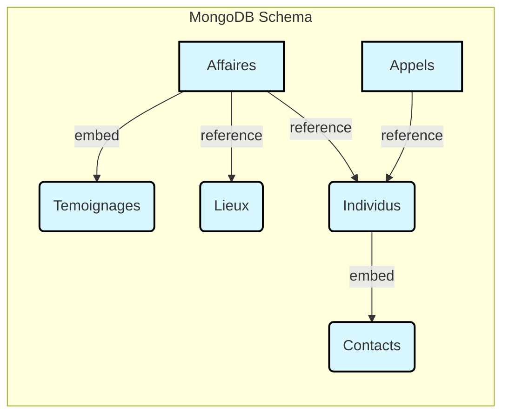
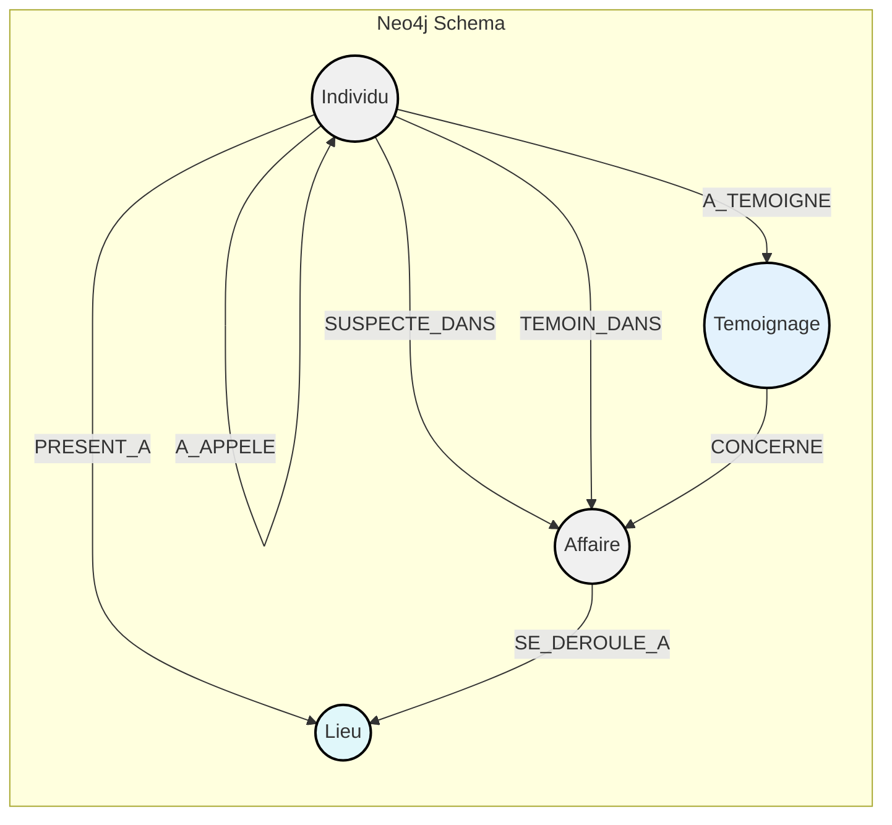

## Groupe

- Mahamadou GORY KANTÉ
- Salahe-eddine BOUHDJEUR

## Installation

```bash
docker-compose up -d
```

### Seed Neo4j

```bash
docker exec -it neo4j cypher-shell -u neo4j -p password -f ./import/seed-neo4j.cypher
```

### Database Schema

## MongoDB



## Neo4j


